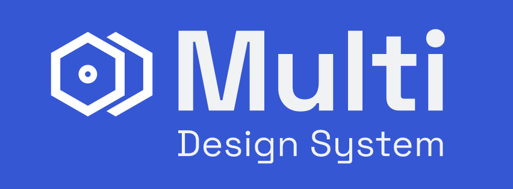

`Multi` is a **customizable**, **scalable** design system for [React](https://es.react.dev/) applications, built on top of [Material UI](https://mui.com/material-ui/). This library provides a cohesive set of components, themes, and utilities ready to use that allow developers to build consistent user interfaces with minimal setup.
